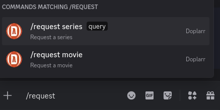
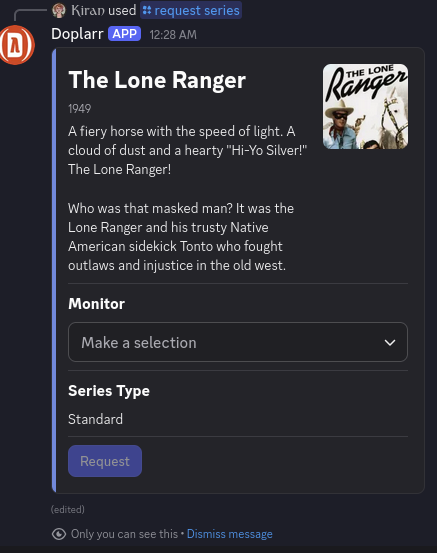

<p align="center">
  
</p>

<p align="center">
  <a href="https://github.com/kiranshila/doplarr_rs/actions/workflows/ci.yml"></a>
  <a href="https://discord.gg/890634173751119882"></a>
  <a href="LICENSE-MIT"></a>
</p>

A modern Discord bot for requesting media through \*arr backends, written in Rust.

## Overview

Doplarr is a Discord bot that allows users to request media from \*arr backends through slash commands.
It integrates seamlessly with your *arr stack (Sonarr, Radarr) to automate media requests from Discord.

This is a **complete rewrite** of the [original Doplarr](https://github.com/kiranshila/Doplarr) (written in Clojure) in Rust, offering improved performance, reduced resource usage, and easier deployment.

### Key Features

- **Modern Discord UI**: Built with Discord's V2 Components for a polished, native-looking interface
- **Slash Commands**: Modern Discord interactions - no message content access needed
- **No Privileged Intents Required**: Minimal permissions for maximum privacy
- **Lightweight**: Minimal resource footprint with fast startup times
- **Simple Configuration**: Single TOML config file with sensible defaults
- **Docker Support**: Pre-built containers available via GitHub Container Registry
- **Extensible**: Clean architecture for adding additional *arr backends

## Screenshots

<p align="center">
  
  
</p>

## What's Different from the Original?

If you're migrating from the Clojure version of Doplarr:

| Feature | Original (Clojure) | This Version (Rust) |
|---------|-------------------|---------------------|
| **Discord UI** | V1 Components | V2 Components (richer layouts) |
| **Configuration** | EDN file or env vars | TOML with validation & helpful errors |
| **Configuration Options** | Basic settings | More robust options (series type: Standard/Anime/Daily, monitor types, minimum availability, etc.) |
| **Logging** | Basic logging | Structured logging with granular levels |
| **Runtime** | Requires Java 11+ | Native binary |
| **Resource Usage** | JVM overhead | Native binary (lightweight) |
| **Startup Time** | Typical JVM startup | Near-instant |

### Migration Notes

- **Configuration format changed**: You'll need to convert EDN/environment variables to TOML format (see [Configuration](#configuration))
  - TOML config provides validation with clear error messages
  - Type-safe configuration catches mistakes at startup
- **Same Discord commands**: The user experience is identical - all slash commands work the same way

## Installation

### Prerequisites

1. **Discord Bot Token**
   - Go to the [Discord Developer Portal](https://discord.com/developers/applications)
   - Create a new application
   - Go to the "Bot" section and create a bot
   - Copy the bot token (you'll need this for configuration)
   - Under "OAuth2" → "URL Generator", select scopes: `bot`, `applications.commands`
   - Use the generated URL to invite the bot to your server

2. **Sonarr and/or Radarr**
   - At least one backend is required
   - Get your API key from Settings → General → Security

### Docker (Recommended)

The easiest way to run Doplarr is using Docker:

```bash
docker run -d \
  --name doplarr \
  --restart unless-stopped \
  -v /path/to/config.toml:/config.toml:ro \
  ghcr.io/kiranshila/doplarr_rs:latest
```

Or using Docker Compose:

```yaml
services:
  doplarr:
    image: ghcr.io/kiranshila/doplarr_rs:latest
    container_name: doplarr
    restart: unless-stopped
    volumes:
      - ./config.toml:/config.toml:ro
```

### Building from Source

#### Using Nix (Recommended)

If you have [Nix](https://determinate.systems/nix-installer/) with flakes enabled:

```bash
# Build the binary
nix build

# Run directly
nix run . /path/to/config.toml

# Build the Docker image
nix build .#dockerImage
docker load < result
```

#### Using Cargo

Requirements:
- [Rust](https://rustup.rs/)
- OpenSSL development libraries (Linux)
- pkg-config (Linux)

```bash
# Clone the repository
git clone https://github.com/kiranshila/doplarr_rs.git
cd doplarr_rs

# Build release binary
cargo build --release

# Run
./target/release/doplarr /path/to/config.toml
```

## Configuration

Create a `config.toml` file with your settings:

```toml
# Required: Your Discord bot token
discord_token = "YOUR_DISCORD_BOT_TOKEN"

# Optional: Logging level (default: "info")
# Format: "target=level" or just "level"
# Levels: error, warn, info, debug, trace
log_level = "doplarr=info"

# Optional: Make follow-up messages public (default: true)
# Set to false to keep all bot responses ephemeral (only visible to requester)
public_followup = true

# Configure Radarr for movie requests
[movie_backend.Radarr]
url = "http://localhost:7878"
api_key = "your_radarr_api_key"

# Optional: Override default quality profile
quality_profile = "HD-1080p"

# Optional: Override default root folder
rootfolder = "/movies"

# Optional: Override default monitor type (movieOnly, movieAndCollection, none)
monitor_type = "movieOnly"

# Optional: Override minimum availability (announced, inCinemas, released)
minimum_availability = "announced"

# Configure Sonarr for TV series requests
[series_backend.Sonarr]
url = "http://localhost:8989"
api_key = "your_sonarr_api_key"

# Optional: Override default quality profile
quality_profile = "WEB-1080p"

# Optional: Override default root folder
rootfolder = "/tv"

# Optional: Use season folders (default: true)
season_folders = true

# Optional: Override default monitor type
monitor_type = "all"

# Optional: Override default series type (standard, daily, anime)
series_type = "standard"

# Optional: Restrict which monitor options users can select
# Available: all, future, missing, existing, firstSeason, lastSeason,
#            latestSeason, pilot, recent, monitorSpecials, unmonitorSpecials, none
allowed_monitor_types = ["firstSeason", "lastSeason", "latestSeason", "pilot", "recent"]
```

### Configuration Tips

- **At least one backend required**: You must configure either `movie_backend` or `series_backend` (or both)
- **Optional settings**: When optional settings (quality_profile, rootfolder, monitor_type, etc.) are not specified in the config, users will be able to select them at runtime through the Discord interface
- **Quality profiles**: Use the exact name as shown in Sonarr/Radarr settings
- **Root folders**: Must be a path that exists in your *arr configuration
- **Monitor types for Sonarr**: The `allowed_monitor_types` setting restricts user choices, preventing selections like "all" which might download too much

## Running as a Service

### systemd (Linux)

Create `/etc/systemd/system/doplarr.service`:

```ini
[Unit]
Description=Doplarr Discord Bot
After=network.target

[Service]
Type=simple
User=doplarr
Group=doplarr
WorkingDirectory=/opt/doplarr
ExecStart=/opt/doplarr/doplarr /opt/doplarr/config.toml
Restart=on-failure
RestartSec=5

[Install]
WantedBy=multi-user.target
```

Enable and start:

```bash
sudo systemctl daemon-reload
sudo systemctl enable --now doplarr
```

### Docker Compose with Auto-restart

The `restart: unless-stopped` policy ensures the bot automatically restarts on failure or system reboot.

## Logging

Logging is configured via the `log_level` setting in your config file. You can set different levels for different components:

```toml
# Just set overall level
log_level = "info"

# Or be more specific
log_level = "doplarr=debug,twilight_gateway=warn"
```

Logs include:
- Connection status to Discord
- Search requests and results
- Backend API calls and responses
- Error details (with sanitized user-facing messages)
- Performance metrics

## Troubleshooting

### Bot not responding to commands

1. **Check bot was invited correctly**: Ensure you used the OAuth2 URL with `bot` and `applications.commands` scopes
2. **Check logs**: Look for connection errors or API issues
3. **Verify token**: Make sure your Discord token is correct
4. **Commands not showing**: Commands register automatically on startup; wait 1-2 minutes or restart Discord

### Backend connection errors

1. **Check URLs**: Ensure Sonarr/Radarr URLs are accessible from where Doplarr is running
2. **Verify API keys**: Test your API keys using the *arr web interface
3. **Network issues**: If using Docker, ensure containers can reach your *arr services
4. **SSL certificates**: Docker image includes CA certificates; if issues persist, check your SSL setup

### Configuration errors

1. **TOML syntax**: Use a TOML validator if you get parse errors
2. **Quality profiles**: Must match exactly (case-sensitive) what's in your *arr settings
3. **Root folders**: Must be paths that exist in *arr configuration
4. **Required fields**: `discord_token` and at least one backend are required

## Development

See [README_DEVELOPER.md](README_DEVELOPER.md) for information on:
- Adding new backend providers
- Generating API bindings from OpenAPI specs
- Contributing to the project

## License

Licensed under either of:

- Apache License, Version 2.0 ([LICENSE-APACHE](LICENSE-APACHE))
- MIT License ([LICENSE-MIT](LICENSE-MIT))

at your option.

## Acknowledgments

- [Twilight](https://github.com/twilight-rs/twilight) for Discord API bindings
- [OpenAPI Generator](https://github.com/OpenAPITools/openapi-generator) for *arr API clients

## Support

- **Issues**: [GitHub Issues](../../issues)
- **Discussions**: [GitHub Discussions](../../discussions)
- **Original Doplarr**: For questions about the Clojure version, see the [original repository](https://github.com/kiranshila/Doplarr)
