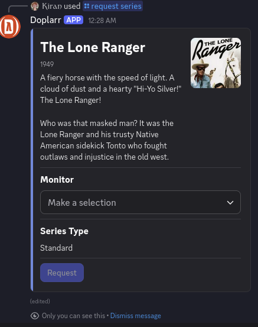

<p align="center">
  
</p>

<p align="center">
  <a href="https://github.com/activexray/doplarr_rs/actions/workflows/ci.yml"></a>
  <a href="https://discord.gg/890634173751119882"></a>
  <a href="LICENSE-MIT"></a>
</p>

A Discord bot for requesting media through \*arr backends, written in Rust.

Each backend you configure creates a `/request <media>` slash command. You can have as many backends as you want — point two Radarr configs at the same instance with different quality profiles to get `/request movie` and `/request movie_4k`, for example.

## Screenshots

<p align="center">
  
</p>

## Setup

### 1. Create a Discord bot

Go to the [Discord Developer Portal](https://discord.com/developers/applications), create a new application, then go to the Bot tab and create a bot. Copy the token — you'll need it in your config.

Under **OAuth2 → URL Generator**, select scopes `bot` and `applications.commands`. If you want request confirmations to be visible to everyone (not just the requester), also add the `Send Messages` bot permission. Use the generated URL to invite the bot to your server.

### 2. Get your backend API keys

- **Sonarr / Radarr**: Settings → General → Security → API Key
- **Seerr**: Settings → API Key — must be an **admin** key

> **Seerr users must link their Discord account.** In Seerr, go to Settings → Notifications → Discord and enable the Discord notification agent. Once that's on, a Discord User ID field appears on each user's profile page. Users need to enter their Discord User ID there before they can make requests. If a user hasn't done this and you haven't set `fallback_user_id`, their requests will be rejected.

### 3. Configure and run

Create a `config.toml` — see the full example below — then run the bot:

```bash
# Docker (recommended)
docker run -d \
  --name doplarr \
  --restart unless-stopped \
  -v /path/to/config.toml:/config.toml:ro \
  ghcr.io/activexray/doplarr_rs:latest
```

Or with Docker Compose:

```yaml
services:
  doplarr:
    image: ghcr.io/activexray/doplarr_rs:latest
    container_name: doplarr
    restart: unless-stopped
    volumes:
      - ./config.toml:/config.toml:ro
```

Commands register automatically when the bot starts. If they don't show up immediately, wait a minute or restart Discord.

## Configuration

See [config.example.toml](config.example.toml) for a complete reference.

```toml
# Required
discord_token = "YOUR_DISCORD_BOT_TOKEN"

# Optional: logging level (default: "info")
# Can be "info", "debug", "doplarr=debug,twilight_gateway=warn", etc.
log_level = "doplarr=info"

# Optional: make request confirmations visible to everyone in the channel (default: true)
# Set to false to keep all responses ephemeral. Requires "Send Messages" permission when true.
public_followup = true

# ============================================================================
# BACKENDS
# ============================================================================
# Each [[backends]] entry creates a /request <media> slash command.
# "media" is the subcommand name — must be unique across all backends.
#
# Optional settings (quality_profile, rootfolder, etc.) prompt the user at
# request time if omitted. Specify them to skip those prompts.

[[backends]]
media = "movie"

[backends.config.Radarr]
url = "http://localhost:7878"
api_key = "your_radarr_api_key"
quality_profile = "HD-1080p"          # must match exactly what's in Radarr settings
rootfolder = "/movies"
monitor_type = "movieOnly"            # movieOnly, movieAndCollection, none
minimum_availability = "announced"    # tba, announced, inCinemas, released

# Same Radarr instance, different quality profile → separate /request movie_4k command
[[backends]]
media = "movie_4k"

[backends.config.Radarr]
url = "http://localhost:7878"
api_key = "your_radarr_api_key"
quality_profile = "Ultra-HD"
rootfolder = "/movies/4k"

[[backends]]
media = "series"

[backends.config.Sonarr]
url = "http://localhost:8989"
api_key = "your_sonarr_api_key"
quality_profile = "WEB-1080p"
rootfolder = "/tv"
season_folders = true
series_type = "standard"              # standard, daily, anime — omit to auto-detect from genres
allow_specials = false                # offer Season 0 when requesting seasons of existing series
# Restrict which monitor options users can pick (omit to allow all)
allowed_monitor_types = ["firstSeason", "lastSeason", "latestSeason", "pilot", "recent"]

[[backends]]
media = "anime"

[backends.config.Sonarr]
url = "http://localhost:8990"
api_key = "your_anime_sonarr_api_key"
series_type = "anime"
rootfolder = "/anime"

# Seerr handles movies and TV in a single backend entry.
# Requires an admin API key. Users must link their Discord User ID in Seerr
# (Profile → Settings → Notifications → Discord) or requests will be rejected.
# That field only appears once the Discord notification agent is enabled in
# Seerr's global settings (Settings → Notifications → Discord).
[[backends]]
media = "media"

[backends.config.Seerr]
url = "http://localhost:5055"
api_key = "your_seerr_admin_api_key"
# fallback_user_id = 1   # attribute unlinked users' requests to this Seerr user ID; omit to reject them
# allow_4k = true        # show a Standard/4K quality choice (only enable if 4K servers are configured in Seerr)
```

## Running as a Service

```ini
# /etc/systemd/system/doplarr.service
[Unit]
Description=Doplarr Discord Bot
After=network.target

[Service]
Type=simple
User=doplarr
Group=doplarr
ExecStart=/opt/doplarr/doplarr /opt/doplarr/config.toml
Restart=on-failure
RestartSec=5

[Install]
WantedBy=multi-user.target
```

```bash
sudo systemctl daemon-reload
sudo systemctl enable --now doplarr
```

## Building from Source

**With Nix:**

```bash
nix build
nix run . /path/to/config.toml
```

**With Cargo** (requires Rust, OpenSSL dev libraries, and pkg-config on Linux):

```bash
cargo build --release
./target/release/doplarr /path/to/config.toml
```

## Troubleshooting

**Bot doesn't respond to commands**
- Make sure you invited the bot with both `bot` and `applications.commands` scopes
- Commands register on startup — wait a minute or restart Discord if they're missing
- Check logs for connection errors

**Backend connection errors**
- Test your API keys directly in the \*arr web UI
- If running in Docker, make sure the container can reach your \*arr services (check network/hostname)
- Quality profile names are case-sensitive and must match exactly what's in Sonarr/Radarr settings

**Seerr: "user not found" or requests rejected**
1. Enable the Discord notification agent in Seerr (Settings → Notifications → Discord)
2. Each user goes to their Seerr profile → Settings → Notifications → Discord and enters their Discord User ID
3. Or set `fallback_user_id` in your config to accept requests from unlinked users

**Config parse errors**
- Validate your TOML syntax (e.g. [jsonformatter.org/toml-validator](https://jsonformatter.org/toml-validator))
- `discord_token` and at least one `[[backends]]` entry are required
- Each backend's `media` value must be unique

## Migrating from the Clojure version

See [MIGRATING.md](MIGRATING.md) for a full config mapping from the old EDN format to TOML, renamed options, and what's been removed.

## Development

See [README_DEVELOPER.md](README_DEVELOPER.md) for adding new backends, generating API bindings, and contributing.

## License

Licensed under either of Apache License 2.0 ([LICENSE-APACHE](LICENSE-APACHE)) or MIT License ([LICENSE-MIT](LICENSE-MIT)) at your option.

## Acknowledgments

- [Twilight](https://github.com/twilight-rs/twilight) for Discord API bindings
- [OpenAPI Generator](https://github.com/OpenAPITools/openapi-generator) for \*arr API clients
